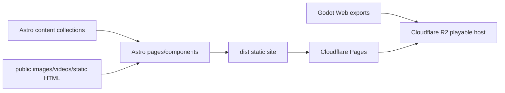

# BIAU Playlab

Astro-powered game showcase and writing site for BIAU Playlab. It publishes Godot project case studies, playable Web entry links, development logs, and selected long-form game/system design articles.

简体中文文档：[README.zh-CN.md](README.zh-CN.md)


## Contents

- [Preview](#preview)
- [Why This Exists](#why-this-exists)
- [Features](#features)
- [Architecture](#architecture)
- [Quick Start](#quick-start)
- [Content Model](#content-model)
- [Deployment](#deployment)
- [Godot Web Playables](#godot-web-playables)
- [Project Structure](#project-structure)
- [Scripts](#scripts)
- [Testing](#testing)
- [Security](#security)
- [Roadmap](#roadmap)
- [License](#license)

## Preview

The site currently curates six game projects:

- `first-tetris`
- `next-spacewar`
- `intespace`
- `raiden`
- `space-war`
- `spacewar-ii`

Public-safe screenshots, posters, SVG covers, and playtest videos live under `public/images/` and `public/videos/`.

## Why This Exists

BIAU Playlab is the game-focused sibling site of the broader BIAU Port ecosystem. Its job is to make small game projects readable as real engineering and design case studies:

- each game has a structured project page;
- development logs connect decisions to implementation stages;
- playable Web builds are hosted separately from the Astro site;
- article content is separated into published posts and a workbench area;
- verification scripts catch broken content references, generated page links, and JSON-LD drift before deployment.

## Features

- Astro 5 static site with collection-based content.
- Game project pages with status, tags, screenshots, videos, playable links, repository links, milestones, and devlog relations.
- Published article collection plus an article workbench for drafts and legacy imported notes.
- Devlog collection linked back to game projects.
- Static asset audit for images and favicon references.
- Production build audit for local links, legacy redirects, and JSON-LD structured data.
- Cloudflare Pages deployment helper for the main site.
- R2 upload helper for Godot Web playable exports.

## Architecture



Main site pages are deployed from `dist/`. Godot Web builds are not committed into the Astro build output by default; they are exported into `deploy/r2-play/` and uploaded to the playable host.

## Quick Start

Prerequisites:

- Node.js 22+
- npm

Install dependencies:

```bash
npm install
```

Start the local dev server:

```bash
npm run dev
```

Build the static site:

```bash
npm run build
```

Run the full local verification:

```bash
npm run verify
```

## Content Model

Astro collections are defined in `src/content/config.ts`.

| Collection | Source | Purpose |
| --- | --- | --- |
| `games` | `src/content/games/*.md` | Structured game project case pages. |
| `devlogs` | `src/content/devlogs/*.md` | Development logs linked to projects. |
| `publishedArticles` | `src/published-articles/*.md` | Public long-form posts. |
| `articleWorkbench` | `src/content/articles/*.md` | Draft/import workspace; only posts with publishable frontmatter are treated as public by the audit. |

The site also keeps public static pages such as `public/games/echo-lab/index.html` and public media under `public/images/` and `public/videos/`.

## Deployment

### Cloudflare Pages

Recommended settings:

| Field | Value |
| --- | --- |
| Framework preset | `Astro` |
| Build command | `npm run build` |
| Build output directory | `dist` |
| Environment variable | `SITE_URL=https://games.playlab.eu.cc` |

Provider-neutral deployment is also possible anywhere that can serve the generated `dist/` directory.

Manual Cloudflare Pages deploy helper:

```bash
npm run deploy:pages -- --project <cloudflare-pages-project>
```

`deploy:pages` runs `npm run verify` before invoking Wrangler.

## Godot Web Playables

Godot Web playable exports are handled outside the normal Astro `dist/` build.

Workflow:

```bash
npm run play:export
npm run play:check
npm run deploy:play -- --bucket <r2-bucket>
npm run deploy:check
```

Important boundaries:

- `deploy/r2-play/` is the prepared local upload directory and is not committed.
- `public/play/` is not the production path for playable exports.
- The public playable host uses project slugs such as `first-tetris`, `next-spacewar`, `intespace`, `raiden`, `space-war`, and `spacewar-ii`.
- Godot export troubleshooting and font synchronization are documented in `docs/godot-export-playbook.md`.

## Project Structure

```text
.
├── src/
│   ├── components/
│   ├── content/
│   ├── layouts/
│   ├── pages/
│   ├── published-articles/
│   ├── styles/
│   └── utils/
├── public/
│   ├── _headers
│   ├── images/
│   ├── videos/
│   └── games/
├── docs/
├── tools/
├── astro.config.mjs
└── package.json
```

## Scripts

| Script | Purpose |
| --- | --- |
| `npm run dev` | Start Astro dev server. |
| `npm run build` | Clean `dist/` and build the static site. |
| `npm run preview` | Preview built output locally. |
| `npm run content:audit` | Check content counts, relations, duplicate ids, tag slug collisions, and public asset references. |
| `npm run dist:audit` | Check built HTML/XML/CSS/JS links, legacy redirects, and JSON-LD. |
| `npm run verify` | Run content audit, build, and dist audit. |
| `npm run play:export` | Export prepared Godot Web playables into the local R2 staging directory. |
| `npm run play:check` | Validate prepared playable exports. |
| `npm run deploy:pages` | Verify and deploy `dist/` to Cloudflare Pages with Wrangler. |
| `npm run deploy:play` | Export, check, and upload playable exports to R2. |
| `npm run deploy:check` | Check public site and playable endpoints. |

## Testing

Minimum pre-commit gate for README/content changes:

```bash
npm run content:audit
git diff --check
```

Recommended release gate:

```bash
npm run verify
```

For live deployment verification:

```bash
npm run deploy:check
```

`deploy:check` calls public endpoints, so run it only when you intentionally want a live network check.

## Security

- Do not commit Cloudflare API tokens, R2 bucket credentials, private hostnames, private dashboards, or local deployment paths.
- Keep Godot export artifacts out of the repository unless a small public-safe asset is intentionally curated under `public/`.
- Do not publish placeholder play links as live playables. `play:check` and `deploy:check` should back every playable-host claim.
- Keep `.env.example` as the only committed environment shape reference.

## Roadmap

- Add project-level README links from each game repository back to its Playlab page.
- Add a public-safe screenshot/video refresh checklist for every game page.
- Add more automated checks for stale repository links and playable host drift.
- Decide whether to keep Playlab as a standalone public site or fold selected case studies into BIAU Port project pages.

## License

This repository is licensed under the [Apache License 2.0](LICENSE).
