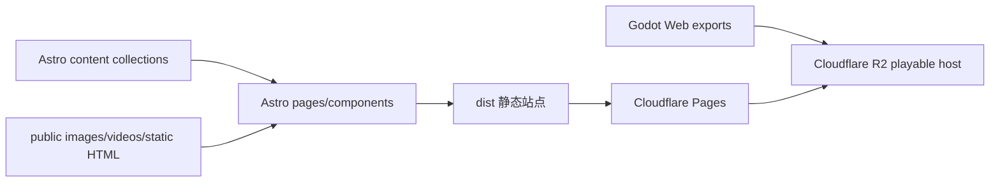

# BIAU Playlab

中文文档 | [English README](README.md)

BIAU Playlab 是一个基于 Astro 5 的游戏项目展示与写作站，用来发布 Godot 项目案例、Web 试玩入口、开发日志和游戏/系统设计长文。

## 当前内容

站点当前整理了 6 个游戏项目：

- `first-tetris`
- `next-spacewar`
- `intespace`
- `raiden`
- `space-war`
- `spacewar-ii`

公开安全截图、封面、SVG 和试玩视频位于 `public/images/` 与 `public/videos/`。

## 功能

- Astro 5 静态站点。
- 使用 content collections 管理 games、devlogs、published articles 和 article workbench。
- 游戏项目页包含状态、标签、截图、视频、试玩链接、仓库链接、里程碑和开发日志关联。
- 内容审计脚本检查图片引用、内容关系、重复 ID 和标签冲突。
- 构建产物审计脚本检查本地链接、legacy redirects 和 JSON-LD。
- Cloudflare Pages 部署辅助脚本。
- Godot Web playable 导出与 R2 上传辅助脚本。

## 架构



Astro 主站从 `dist/` 部署。Godot Web 构建不默认提交到 Astro 输出目录，而是导出到 `deploy/r2-play/` 后上传到 playable host。

## 快速开始

要求：

- Node.js 22+
- npm

```bash
npm install
npm run dev
```

构建：

```bash
npm run build
```

完整本地验证：

```bash
npm run verify
```

## 部署

推荐 Cloudflare Pages：

| 字段 | 值 |
| --- | --- |
| Framework preset | `Astro` |
| Build command | `npm run build` |
| Build output directory | `dist` |
| Environment variable | `SITE_URL=https://games.playlab.eu.cc` |

其他静态托管平台也可以直接部署生成的 `dist/`。

## Godot Web 试玩包

```bash
npm run play:export
npm run play:check
npm run deploy:play -- --bucket <r2-bucket>
npm run deploy:check
```

边界：

- `deploy/r2-play/` 是本地上传准备目录，不提交。
- `public/play/` 不是生产 playable 导出路径。
- 试玩 host 使用 `first-tetris`、`next-spacewar`、`intespace`、`raiden`、`space-war`、`spacewar-ii` 等 slug。

## 检查

文档/内容改动的最小检查：

```bash
npm run content:audit
git diff --check
```

发布前建议：

```bash
npm run verify
```

线上检查：

```bash
npm run deploy:check
```

`deploy:check` 会访问公网端点，只在明确需要 live check 时运行。

## 安全边界

- 不提交 Cloudflare API token、R2 凭据、私有主机名、私有 dashboard 或本地部署路径。
- Godot 导出产物默认不进仓库，除非是明确筛选过的公开安全素材。
- 不把占位试玩链接写成可用试玩入口。
- `.env.example` 是唯一可提交的环境变量形状参考。

## 许可证

当前仓库还没有独立许可证文件。正式作为可复用开源项目推广前，需要选择并添加许可证。
